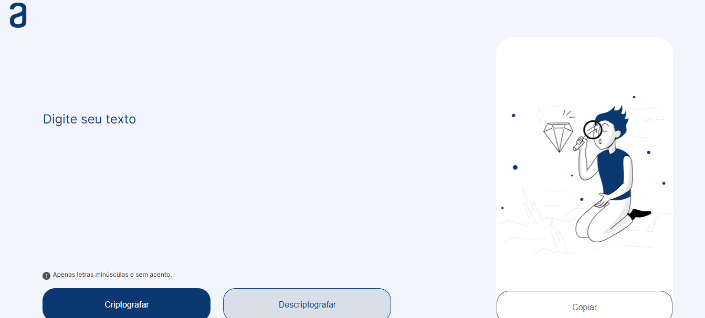
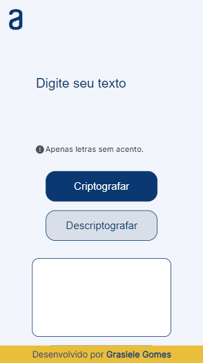

# Projeto Decodificador 
    Projeto para o primeiro Challenge da ONE/ALURA
    A página apresenta um encriptador/desencriptador de mensagens, que irá encriptar/desencriptar todas as vogais escritas.

## 28/08/2023 - Atualização
    Decidi acrescentar responsividade à página, que agora pode ser acessada tando em celulares como em tablets e desktops.

[Link para a página no Github pages](https://ggms13.github.io/decodificador/)

## Screenshots:

